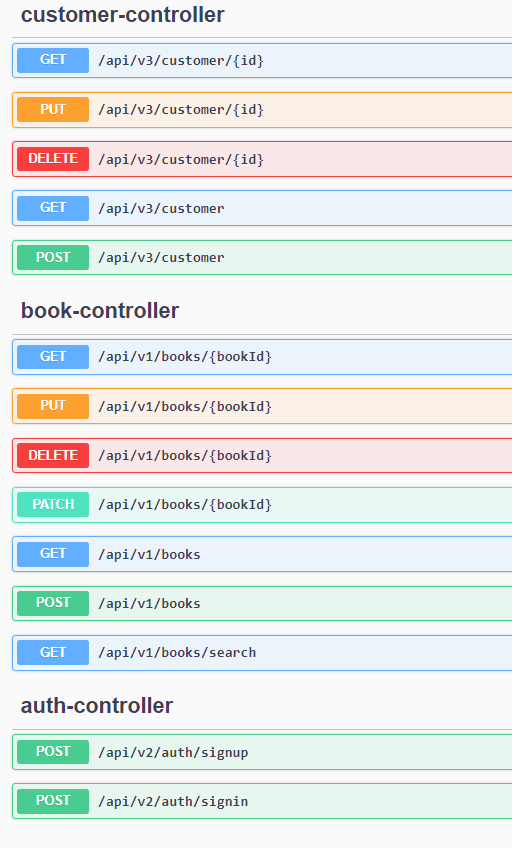
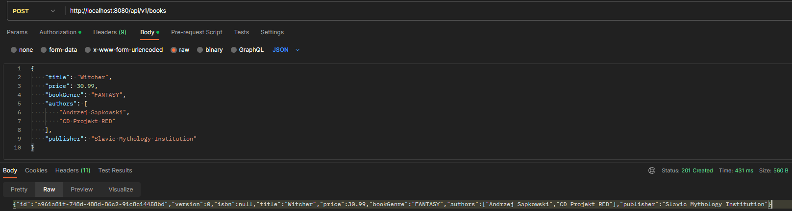
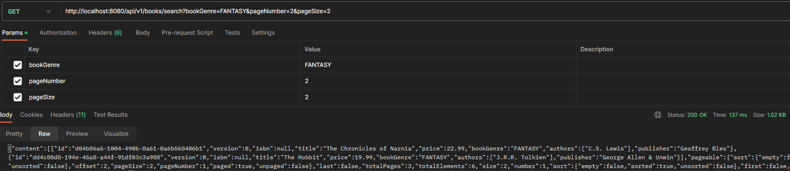
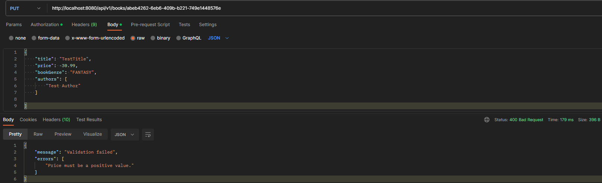
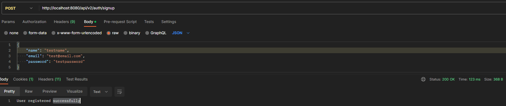
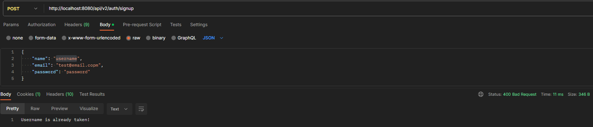

# Book Store Application

## Description

The Book Store Application is a simple and feature-rich CRUD (Create, Read, Update, Delete) 
application developed for managing a book store. It is built using technologies such as Java 17 
and Spring 6, providing a robust and scalable solution. The application utilizes H2 in-memory 
database for development and testing purposes.

### Features

**1. User Registration and Login:**

- Users can create new accounts by providing their details such as name, email, and password.
- Secure authentication and authorization mechanisms are implemented using Spring Security.
- Registered users can log in using their credentials to access the application's features.

**2. Book Management:**

- The application allows administrators to manage books in the store.
- CRUD operations (Create, Read, Update, Delete) are available for managing book records.
- Book information such as title, author, genre, price, and availability can be easily managed.

**3. Book Order Management:**

- Customers can place orders for books they wish to purchase.
- Orders are associated with the respective customers and include details such as book, quantity, and order status.
- Administrators have access to manage and track book orders, update their status, and fulfill customer requests.

**4. Customer Management:**

- Customer records are stored and managed in the application.
- CRUD operations are available to create, retrieve, update, and delete customer information.
- Each customer is associated with their orders, allowing for seamless order tracking and management.

**5. API Documentation:**

- The application generates comprehensive API documentation using Swagger/OpenAPI.
- Developers and users can easily explore and understand the available endpoints, request/response formats, and authentication requirements.
- The API documentation is accessible through a user-friendly Swagger UI interface.

## Prerequisites

Before running this application, make sure you have the following installed:

- network connection
- Java 17
- Maven

## Dependencies / Technology

This project has the following dependencies:

- **Spring Boot Starter Web**
- **Spring Boot Starter Validation**
- **Spring Boot Starter Data JPA**
- **H2 Database**
- **Spring Boot Starter Security**
- **Spring Security Test**
- **Spring Boot Starter Test**
- **JUnit / Mockito**
- **Spring Boot DevTools**
- **Lombok**
- **MapStruct**
- **Springdoc OpenAPI Starter**

## Getting Started

1. Clone the repository:

`git clone https://github.com/YunYunoy/bookstore.git`

2. Navigate to the project directory:

`cd bookstore`

3. Build the project:

`mvn clean install`

4. Set up the database:

`Application uses H2 in-memory database, so there is no additional setup for database required.`

5. Run the application:

`mvn spring-boot:run`

6. Open your web browser and access the application:

http://localhost:8080

## API Documentation

The API documentation is generated using OpenApi. You can access it by visiting the following URL:

http://localhost:8080/swagger-ui.html

### OpenApi Screenshots

## Security 

Application utilizes method-level security and for full accessibility please use in-built admin-user:

- `type: Basic Auth`
- `username: admin`
- `password: admin`

## Testing

The application underwent testing using **JUnit**, **Mockito**, and **Postman**.
Junit and Mockito were utilized for unit testing and mocking 
dependencies, ensuring the quality and accuracy of the code.
Postman was employed to perform integration and API testing, 
validating the functionality and interactions of the application 
components.

### Postman screenshots

###### book/controller.POST

###### book/controller.GET

###### book/controller.PUT (not-validated-response)

###### auth/controller.POST

###### auth/controller.POST (not-validated-response)

## Project Structure

The project follows a standard Maven directory structure:

- src/main/java: Contains the Java source files.
- src/main/resources: Contains the application properties and static resources.
- src/test/java: Contains the test classes.

## Contributing

Contributions to this project are welcome. If you find any issues or have suggestions for improvements, please create an issue or submit a pull request.

